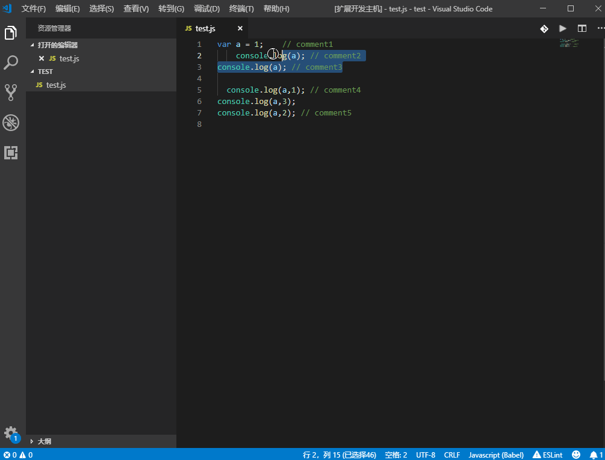

# comment-aligner README

## Features

A new extension for aligning the inline trailing comment.

It can align your inline trailing comment except the normal code line.

It will be like this:

## Requirements

None.

## Extension Settings

TODO.

## License

MIT.

## Resource code

https://github.com/gitshan/vscode-extension-comment-aligner.

## Release Notes

### 1.0.1

Add notes.

### 1.0.0

Fix bug: the problem that occurs in line content with comment symbol.

### 0.0.2

Add detail notes and fix bug.

### 0.0.1

A new extension for aligning the inline trailing comment.